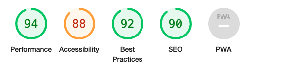
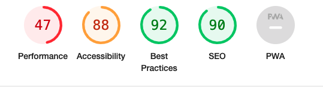
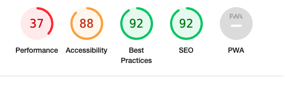
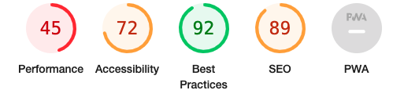
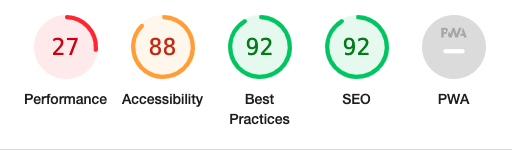

# Testing

[Back to main README.md](README.md)

**W3C HTML Validator Results**

**W3C CSS Validator Results**

**PEP8 Online**

**Lighthouse**

Have tested the website using the Lighthouse via Google Developer Tools for it accessibility, SEO and best practice.

On Desktop:

Products page

Products Detail page

Checkout page

On Mobile:

Products page

Products Detail Page

Checkout page

Looking at those results, I need to improved on performance of the site especially on mobile.
For future development, need to be a more focus on mobile first development environment and 
to understand more better about images to improve loading times.

## Testing User Stories
