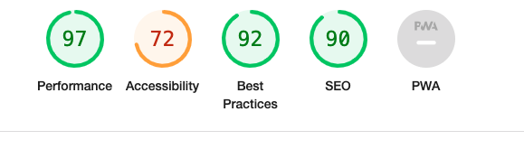

# Testing

[Back to main README.md](README.md)

**W3C HTML Validator Results**

Had no error with HTML checker

**W3C CSS Validator Results**

Had no error with HTML checker

**Lighthouse**

Have tested the website using the Lighthouse via Google Developer Tools for it accessibility, SEO and best practice.

On Desktop:

Products page

Products Detail page

Checkout page

On Mobile:

Products page

Products Detail Page

Checkout page

Looking at those results, I need to improved on performance of the site especially on mobile.
For future development, need to be a more focus on mobile first development environment and 
to understand more better about images to improve loading times.

## Testing

**Navigation**

| Feature     |                 Expected            | Testing                    | Result                  | Pass/Fail  |
|----------   |---------------------------          |-----------------------     |-------------------------|------------|
| Home Button |  To redirect to home page           | Click on home button       |  Navigates to home page | Pass       |
|  Nav Links  |  Dropdown products menu             | Click on all product link  |  Dropdown menu appear   | Pass       |
|        |  Dropdown skiing menu               | Click on skiing link       |  Dropdown menu appear   | Pass       |
|        |  Dropdown clothing menu             | Click on clothing link     |  Dropdown menu appear   | Pass       |
|        |  Dropdown accessorie menu           | Click on accessories link  | Dropdown menu appear    | Pass       |
|        |  To redirect to contact page        | Click on contact link      | Navigate to contact page    | Pass       |
|        |  Dropdown account menu              | Click on account link      | Dropdown menu appear    | Pass       |
|        |  To redirect to basket page         | Click on basket link       | Navigate to basket page   | Pass       |
|        |  Redirect to products pages         | Click on any of products link  | Navigate to any products page    | Pass       |
|        |  Redirect to skiing product pages   | Click on any skiing link  | Navigate to any skiing pages    | Pass       |
|        |  Redirect to clothing product pages | Click on any clothing link  | Navigate to any clothing page    | Pass       |
|        |  Redirect to accessories pages      | Click on any accessories link  | Navigate to any accessories page    | Pass       |
|             | Redirect to any account pages | Click on any account link  | Navigate to any account page  | Pass  |
|  Footer           |  Redirect to Facebook in new tab | Click Facebook icon  | Facebook page opened in new tab  | Pass  |
|             |  Redirect to Twitter new tab | Click Twitter icon  | Twitter page opened in new tab  | Pass  |
|           |  Redirect to Instagram in new tab | Click Instagram icon  | Instagram page opened in new tab  | Pass  |
|            |  Redirect to Pinterest in new tab | Click Pinterest icon  | Pinterest page opened in new tab  | Pass  |
|  Nav Link As Superuser |  Redirect to product management page | Click Product Managment | Navigate to Product Management  | Pass  |

**Search Bar**

| Feature  | Expected  |  Testing | Result  | Pass/Fail  |
|---|---|---|---|---|
| All users  | Clicking in search box  | able to type inside search box  | write in search box  |  Pass |
|   | search for products  | able to search for products  | render all products that was search for  | Pass |
|   | Clicking search button  | able to click the button  | render all products that was search for  |  Pass |

**Product Management Page**

| Feature  | Expected  |  Testing | Result  | Pass/Fail  |
|---|---|---|---|---|
| SuperUser  | Click on inuput field  | able to type inside search box  | write in search box  |  Pass |
|   | Click on cancel button  | Click on cancel button  | redirect to products page  | Pass |
|   | Click on add button  | Click on add button  | add new product and redirect to products page  |  Pass |

**Contact Page**

| Feature  | Expected  |  Testing | Result  | Pass/Fail  |
|---|---|---|---|---|
|  Form | Form validation for email requires @ symbol  | Attempt to submit without @ in input field  | Form validation requests valid email address  | Pass  |
|   | Form validation for Subject field  | Attempt to submit without subject field  | Form validation request field to be filled in  | Pass  |
|   | Form validation for Message field  | Attempt to submit without message field  | Form validation request field to be filled in   |  Pass |
|   | Submit message  | Fill in form ci=orrectly and submit  | Redirect to new page with successful message  |  Pass |

**Profile Page**

| Feature  | Expected  |  Testing | Result  | Pass/Fail  |
|---|---|---|---|---|
| To be able to update delivery information  | information to update upon clicking update information button  | update information  | information is updated  | Pass |
| Click update information button  | click the button, expecting information to update | click update information button  |  information get updated | Pass  |
| Click order history order number  | click order history order number, redirects to order confirmation page  | click order history order number  | redirects to order confirmation page  | Pass  |

**Login Page**

| Feature  | Expected  |  Testing | Result  | Pass/Fail  |
|---|---|---|---|---|
| Log in functionality  | Correct user/pass combination directs user to the home page   | Log in with correct username/password combination  | Redirected to home page   | Pass  |
|   | Incorrect username/password combination shows error message  | Attempt to log in with incorrect credentials  | "The username and/or password you specified are not correct." error message appears  | Pass |
|  Link to Register | Redirect to Sign Up page  | Click link to sign up page  | Redirected to sign up page  | Pass  |

**Register Page**

| Feature  | Expected  |  Testing | Result  | Pass/Fail  |
|---|---|---|---|---|
| Register functionality  | Form validation for email requires @ symbol  | Attempt to register without @ in input field  |  Form validation requests valid email address | Pass  |
|   |  E-mail Again value must be same as Email value | Attempt to register with incorrect email in email  |  Form validation requests email address must match | Pass  |
|   | Username must be between 4 and 15 characters  | Attempt to enter username with less than 4 characters  |Feedback error displayed | Pass  |
|   | Username must be between 4 and 15 characters  | Attempt to enter username with more than 15 characters  | Form restricts the user from using more than 15 characters  |  Pass |
|   | Password must be longer than 8 characters  |  Attempt to enter password with less than 8 characters | Form restricts the user from using less than 8 characters  | Pass  |
|   | Register with new user and password to be logged in and redirected to home page  | Enter email address, name, username, password and click register  | New account registered and home page shown  | Pass  |

**Products Page**

| Feature   | Expected  | Testing  | Result  | Pass/Fail  |
|---|---|---|---|---|
| All products are visible  | Products page shows all products on page  | Open Products page and view products  | All products visible  | Pass |
|   | Searching by category shows products from that category  | Select to search by each category   | Products from each category successfully displayed  |  Pass |
| Sort field  |  Sort through products by using sort field  | Sorting through products using A-Z, low to high etc  | Products are updated to reflect the sorting criteria  | Pass |

**Product Detail Page**

| Feature   | Expected  | Testing  | Result  | Pass/Fail  |
|---|---|---|---|---|
| Product Details  |  Product description displayed | Click on products, redirect to product detail page and display description  | Product description displayed  | Pass  |
| Add to bag  | Click Add To Basket adds the product to the basket  | Open Product Detail page click add to basket  | Product available in bag  |  Pass |
|   | If product has sizes, able to select sizes  | Select large and add to basket  | Item with correct size added to basket  | Pass  |
|   |  Select the number of quantity | Select 3 as quantity of item  | Item added to basket with the correct quantity  | Pass  |

**Edit Product Page**

| Feature   | Expected  | Testing  | Result  | Pass/Fail  |
|---|---|---|---|---|
| Edit Products  | Only admin is allowed to visit edit product page  | Log in as non-superuser and attempt to access products edit page | Can't access page   |  Pass |
| Form Validation  | Required fields must be completed to edit the product  | Attempt to edit product without filling in a required field  | Error message "Please fill in this field"  | Pass  |

**Basket Page**

| Feature   | Expected  | Testing  | Result  | Pass/Fail  |
|---|---|---|---|---|
| View Items  | See items added to basket  | Add product to basket and check correct item, quantity and total | Expected products, quantity and total  | Pass  |
| Update Items | Update the number of items in basket, the quantity and price reflect the update  | Change quantity of an item  | The basket reflect the new quantity and price  | Pass |
| Remove Items | Remove an item from the basket  | Remove an item from basket  | Basket updated to reflect the removal of an item  | Pass  |
| Keep Shopping | Redirect you to products page  | Click on keep shopping  | Button redirect to all products page  | Pass  |
| Empty basket | A message to say there no items  | Click on shopping basket with no items   | There message to say basket is empty  | Pass  |

**Checkout Page**

| Feature   | Expected  | Testing  | Result  | Pass/Fail  |
|---|---|---|---|---|
| All users  | Enter all information needed to complete the order  | to be able to input all information into input boxes  | Able to enter all information to complete order  | Pass  |
|   | Click on adjust bag button  | redirect back to shopping basket page  | taken back to shopping basket page  | Pass  |
|   | Click on secure checkout button  | redirect to new page order success  |  was taken to new page order success | Pass  |
| Form Validation  | Required fields must be completed to complete  | Attempt to check out without filling in a required field  | Error message "Please fill in this field"  | Pass  |